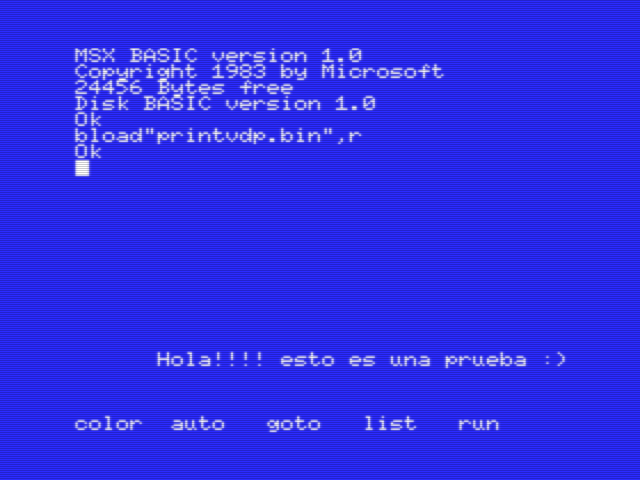
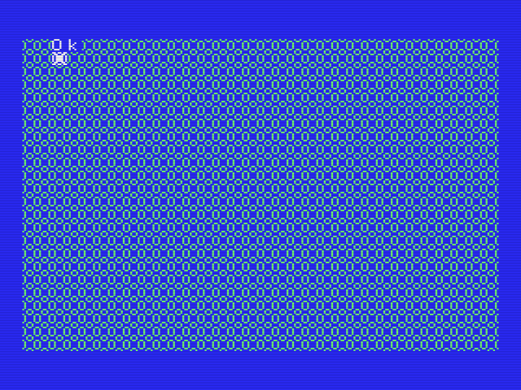
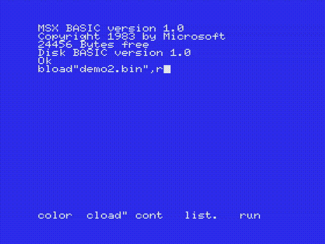

# msx-asm
Ejemplos para assembler de Z80 para MSX. Escritos para asmsx. PRs son bienvenidos.

## Ejemplos:

### chput

Usa la rutina de bios CHPUT para imprimir un caracter especial.

### print

Usa llamadas a la rutina del bios CHPUT para imprimir una cadena de caracteres.

### chputvdp

Escribe la NAME TABLE para dibujar un asterisco en la pantalla en modo 0 utilizando llamados al VDP.

### printvdp

Escribe la NAME TABLE para escribir un string en pantalla utilizando un loop.

### h_timi 

Atiende a la interrupción de VBlank, H.TIMI

### write_register

Escribe un registro del VDP para cambiar el color de fondo y frente.

### chmod

Inicializa un modo gráfico utilizando una llamada a la función CHMOD del bios.

### sprites

Escribe la tabla de atributos de sprites, y registros del VDP para mostar un sprite en screen 1.

### dump_to_vram 

Escribe una imagen guardada en RAM a VRAM.

## Demos

Programitas que usan funciones de los ejemplos pequeños para hacer cosas más complejas.

### demo 0 

Modifica un tile y lo muestra en toda la pantalla.

### demo 1

Modifica un tile y lo muestra en toda la pantalla, pero también lo anima en cada VBlank, desplazandolo a la izquierda.

### demo 2

Muestra un sprite y lo mueve en cada VBlank

