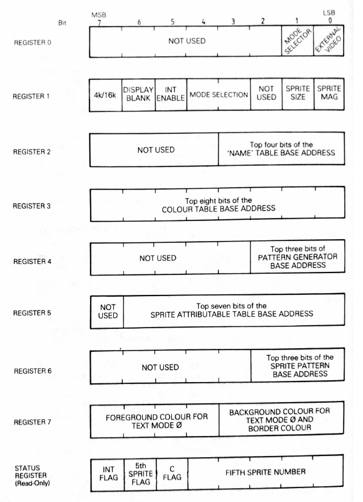

### Escribir un registro del VDP

Se necesitan 2 bytes para escribir un registro: El valor y el número de registro, y ambos se envían al puerto 0x99.

1. `0x99` <- Valor
2. `0x99` <- Número de registro (el 7mo bit debe ser 1)


En lugar de hacer llamados a out, podemos usar un llamado a una función del BIOS, si es que está disponible:

0x47  
In: Registro en C, data en B  
Out: Modifica AF,BC  

ejemplo:

```
ld c, 6     ; registro
ld b, 0     ; dato
call 0x47
```

### Leer un registro del VDP

No se pueden leer, pero si el BIOS los escribió, guarda una copia de los valores en: 

|Registro | Dirección |
|---------|-----------|
|0| `0xF3DF`|
|1| `0xF3E0`|
|2| `0xF3E1`|
|3| `0xF3E2`|
|4| `0xF3E3`|
|5| `0xF3E4`|
|6| `0xF3E5`|
|7| `0xF3E6`|
------------

### Registros
  


(imagen extraída de "Behind the screens of the MSX" por Mike Shaw)