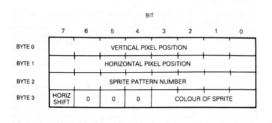

## Sprites

#### Sprites de 8 bytes

256 sprites distintos.

#### Sprites de 32 bytes

8 bytes por cuadrante:

1. Top Left
2. Bottom Left
3. Top Right
4. Bottom Right

64 sprites distintos.

### Tabla de patrones

La tabla de patrones ocupa 2048 bytes como máximo.

Base Address: 0x3800
cuando está inicializado por rutinas de ROM.

### Tabla de atributos de sprites

4 bytes por sprite.

Base Address: 0x1B00
cuando está inicializado por rutinas de ROM.

Byte 0:

Posición vertical, si es 209 decimal el sprite desaparece. 208 hace lo mismo, pero apaga los sprites sucesivos.

### Conociendo la dirección de las tablas

La ROM incluye una rutina para obtener la dirección del Pattern Table:

Address: 0x084  
In: numero de sprite en registro A  
Out: la dirección en HL. Cambia AF,DE,HL.

